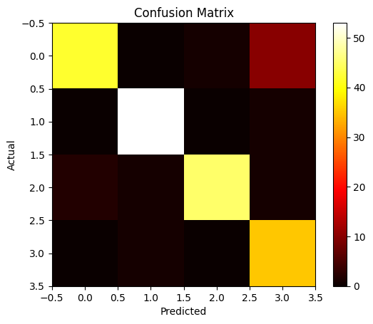

# NLP Assignment 1 - POS Tagging
## Harshavardhan P - 2021111003

 
> All evaluations were done on RNN model with 2 linear layers for classification, and run for 15 epochs. Further runs noticed overfitting for the model, and hence the model was stopped at 15 epochs.

## Hyperparameters
### SVD
- `n_components` = 200
- `context_size` = [2, 4, 6, 8]
- trained on entire corpus and no words were dropped
- tokenisation used was `nltk.word_tokenize` with `punkt` and `stopwords`

### Skipgram - Word2Vec
- `embedding_size` = 200
- `window_size` = [2, 3, 4, 5]
- `negative_samples` = 5
- `iterations` = 5
- trained on entire corpus and no words were dropped
- tokenisation used was `nltk.word_tokenize` with `punkt` and `stopwords`

### RNN
- `embedding_size` = 200
- `hidden_size` = 256
- `activation` = `relu`
- `epochs` = 15
- `batch_size` = 512
- `optimizer` = `Adam` with `lr` = 0.001
- `loss` = `CrossEntropyLoss`

## Graphs and Evaluation Metrics
### SVD
- `context_size = 2`
    - Training Loss:  0.289276533165866
    - Training Accuracy:  0.9166666666666666
    - Training Precision:  0.9177037875617726
    - Training Recall:  0.9166666666666666
    - Training F1 Score:  0.9169414674587127

    - Test Loss:  0.42728238574391403
    - Test Test Accuracy:  0.8541666666666666
    - Test Precision:  0.8565292639902685
    - Test Recall:  0.8541666666666666
    - Test F1 Score:  0.8515436078769407

    - Training Confusion Matrix:
    

    - Test Confusion Matrix:
    

- `context_size = 4`
    - Training Loss:  0.2499755505079495
    - Training Accuracy:  0.921875
    - Training Precision:  0.9220264050387597
    - Training Recall:  0.921875
    - Training F1 Score:  0.9213293650793651

    - Test Loss:  0.31561093500757953
    - Test Test Accuracy:  0.8981481481481481
    - Test Precision:  0.8980129291904612
    - Test Recall:  0.8981481481481481
    - Test F1 Score:  0.89803062172373

    - Training Confusion Matrix:
    

    - Test Confusion Matrix:
    

- `context_size = 6`
    - Training Loss:  0.318842687672614
    - Training Accuracy:  0.8854166666666666
    - Training Precision:  0.8915686163806082
    - Training Recall:  0.8854166666666666
    - Training F1 Score:  0.8856323132313232

    - Test Loss:  0.36437050953518374
    - Test Test Accuracy:  0.8634259259259259
    - Test Precision:  0.8628899760100404
    - Test Recall:  0.8634259259259259
    - Test F1 Score:  0.8627643418035015

    - Training Confusion Matrix:
    

    - Test Confusion Matrix:
    

- `context_size = 8`
    - Training Loss:  0.28026979596486107
    - Training Accuracy:  0.9270833333333334
    - Training Precision:  0.9284761282354218
    - Training Recall:  0.9270833333333334
    - Training F1 Score:  0.9268574733359364

    - Test Loss:  0.39693709872638067
    - Test Test Accuracy:  0.8657407407407407
    - Test Precision:  0.8672260792672719
    - Test Recall:  0.8657407407407407
    - Test F1 Score:  0.8654307791090595

    - Training Confusion Matrix:
    

    - Test Confusion Matrix:
    

### Skipgram - Word2Vec
- `window_size = 2`
    - Training Loss:  0.060091822660559235
    - Training Accuracy:  0.9739583333333334
    - Training Precision:  0.9748460144927535
    - Training Recall:  0.9739583333333334
    - Training F1 Score:  0.9740319865319865

    - Test Loss:  0.42007982760651547
    - Test Test Accuracy:  0.8819444444444444
    - Test Precision:  0.8846051379283391
    - Test Recall:  0.8819444444444444
    - Test F1 Score:  0.8815450919025843

    - Training Confusion Matrix:
    

    - Test Confusion Matrix:
    

- `window_size = 3`
    - Training Loss:  0.24733062419785884
    - Training Accuracy:  0.921875
    - Training Precision:  0.9278675426136364
    - Training Recall:  0.921875
    - Training F1 Score:  0.921161061030348

    - Test Loss:  0.316475718751562
    - Test Test Accuracy:  0.9004629629629629
    - Test Precision:  0.9032375332696602
    - Test Recall:  0.9004629629629629
    - Test F1 Score:  0.9001075985163026

    - Training Confusion Matrix:
    

    - Test Confusion Matrix:
    

- `window_size = 4`
    - Training Loss:  0.26385217180957077
    - Training Accuracy:  0.9114583333333334
    - Training Precision:  0.92380503111597
    - Training Recall:  0.9114583333333334
    - Training F1 Score:  0.9124644119744595

    - Test Loss:  0.35017520377290345
    - Test Test Accuracy:  0.8865740740740741
    - Test Precision:  0.8910486888228436
    - Test Recall:  0.8865740740740741
    - Test F1 Score:  0.8854400451951334

    - Training Confusion Matrix:
    

    - Test Confusion Matrix:
    

- `window_size = 5`
    - Training Loss:  0.12196256871512079
    - Training Accuracy:  0.9583333333333334
    - Training Precision:  0.9595352564102564
    - Training Recall:  0.9583333333333334
    - Training F1 Score:  0.9585551236044655

    - Test Loss:  0.4674114336067104
    - Test Test Accuracy:  0.8634259259259259
    - Test Precision:  0.8709821109760044
    - Test Recall:  0.8634259259259259
    - Test F1 Score:  0.8636638747632817

    - Training Confusion Matrix:
    

    - Test Confusion Matrix:
    

## Analysis and Observations
> All runs can be found [here](https://wandb.ai/rockingharsha71/news-classification?nw=nwuserrockingharsha71) on wandb.
- There was no difference in performance between different context sizes for SVD. The model performed equally well for all context sizes. The variation in performance seen here when averaged over multiple runs, turns out to be negligible.
- The Skipgram model performed better than SVD model in all cases. The model was able to learn better representations of words and hence performed better in classification. Also the model had higher training accuracy as compared to SVD model, more significantly than the increase in test accuracy.

- Potential Advantages of Skip-gram:

    - Learning Semantic Relationships: Skip-gram explicitly captures semantic relationships by predicting surrounding words based on a center word. This can lead to better word vector representations that capture meaning.

    - Scalability: Skip-gram can be more scalable to larger datasets compared to SVD, which can become computationally expensive with massive amounts of text.

- Potential Shortcomings of SVD:

    - Statistical Dependence: SVD focuses on co-occurrence statistics, which might not always reflect semantic relationships. Words appearing together might not necessarily share meaning (e.g., "the" and "quick").

    - Dimensionality Reduction: SVD compresses the data, potentially losing some semantic information compared to Skip-gram which can learn more fine-grained word representations.

- Potential Shortcomings of Skip-gram:

    - Computational Cost: Training Skip-gram models, especially on large datasets, can be computationally expensive compared to SVD. While SVD needs more statistical information in co-occurrence matrix, Skip-gram needs to learn the embeddings from scratch, meaning more learning in epochs.
    - Rare Words: Skip-gram might struggle with representing rare words that don't appear frequently in the training data.

## Trained Models
Trained models can be found here: [Google Drive](https://drive.google.com/drive/folders/1K2S2Y65wUBCHhEjnzmuWarMAi2XGkQ-0?usp=sharing) in this google drive folder.